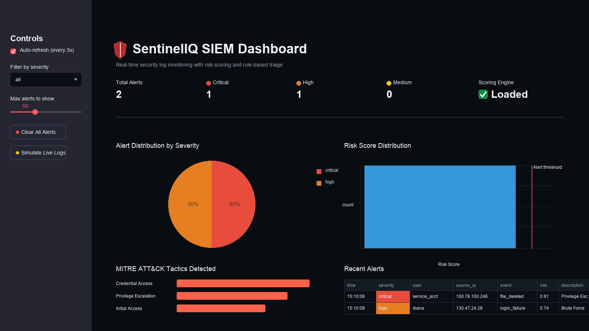

# SentinelIQ

SentinelIQ is a small SIEM-style monitoring project I put together to test how security logs can be scored, triaged, and displayed in a live dashboard. It has a FastAPI backend for ingestion, a Streamlit dashboard for the operator view, a synthetic log generator, and a rule layer that maps suspicious activity to MITRE ATT&CK tactics.

The project is intentionally compact. I wanted the moving parts to stay readable: generate logs, turn them into features, score the event, apply practical alert rules, and show the result without needing a full SOC stack.



## What It Does

- Ingests individual or batch security log events through an API.
- Scores events with a saved Isolation Forest model.
- Adds rule-based context for common cases like brute force attempts, suspicious processes, risky ports, exfiltration patterns, and after-hours admin activity.
- Stores recent alerts in memory for quick demos and local testing.
- Shows live alert counts, severity charts, risk score distribution, MITRE tactics, and the latest alert table in Streamlit.

## Project Layout

```text
api/                  FastAPI service
dashboard/            Streamlit dashboard
src/                  log generation, feature extraction, scoring, alert rules
data/sample_logs.csv  sample training/demo data
models/               saved scoring model
tests/                unit tests for features and alert logic
```

## Setup

```bash
python -m venv venv
source venv/bin/activate
pip install -r requirements.txt
```

The repository already includes sample data and a saved model. To rebuild both from scratch:

```bash
python -m src.train
```

## Run Locally

Start the API:

```bash
uvicorn api.main:app --reload
```

In a second terminal, start the dashboard:

```bash
streamlit run dashboard/app.py
```

The dashboard expects the API at `http://127.0.0.1:8000`.

## Useful Endpoints

- `GET /` checks service health.
- `POST /ingest` processes one log event.
- `POST /ingest/batch` processes several events.
- `GET /simulate` creates and processes one demo log.
- `GET /alerts` returns recent alerts.
- `DELETE /alerts/clear` clears the in-memory alert list.

## Tests

```bash
pytest
```

## Notes

This is built as a local demo and learning project, so the alert store is in memory and resets when the API restarts. For a production-style version, I would move alerts into a database, add authentication, keep model versions, and wire ingestion to real log sources instead of the sample generator.
